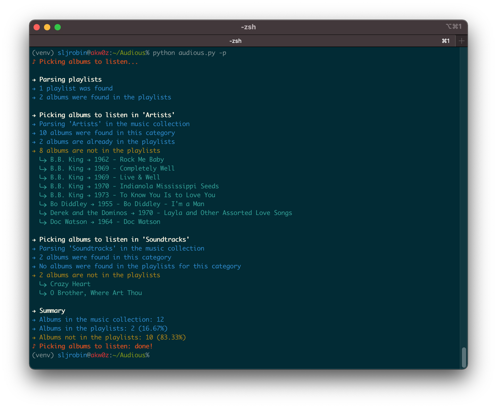
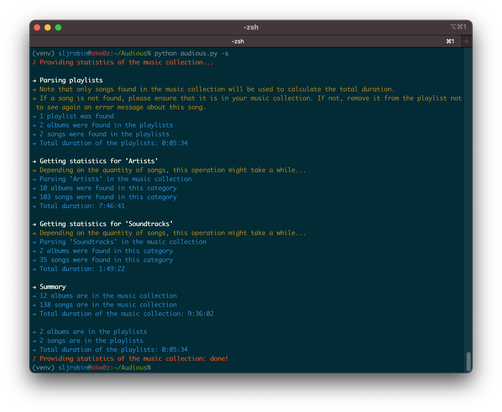
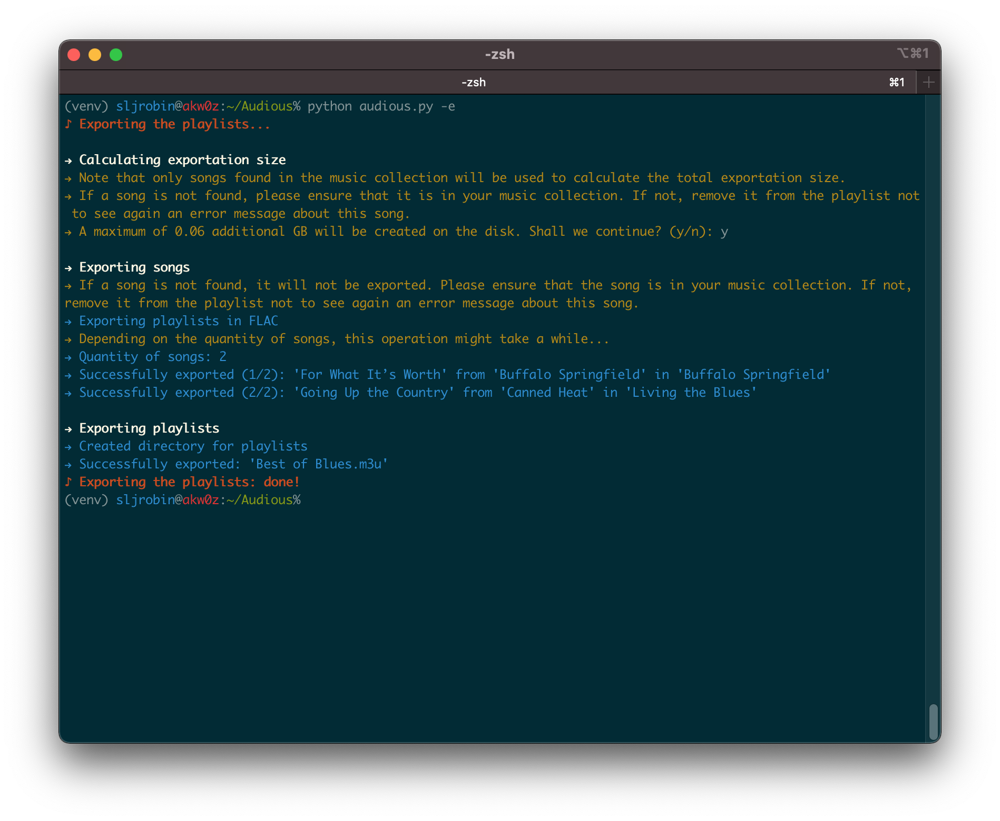

<p align="center"></p>

**Audious** is a *virtual assistant for music collections*. Amongst other things, it provides the ability to **manage albums** by indicating the ones which are not in **playlists**. It also gives **detailed statistics** about a music collection, such as the number of artists and albums or the overall duration of a music category. It can also be used to **sanitize playlists** by showing corrupted or missing songs, and can **export playlists** in different formats, such as FLAC or MP3.

<p align="center">🎶</p>

### 🧠 Broaden your musical horizons
The more your music collection will grow, the more it will be difficult to remember which albums and songs you liked or listened to. Playlists are there to help us reminding which songs or albums we liked. But there might be albums that you didn't place in a playlist. **Audious will help you managing the albums that are not present in your playlists.**



### 🔎 Learn to know your music collection
Having information about the song currently being played or even the year of the album you want to listen to is easy. However, getting the number of artists and albums, or how finding long it would take you if you wanted to listen to your entire music collection, it's a different story. **Audious will give you statistics about your music collection as well as your playlists.**



### ❤️ Less is more
Nowadays, space is cheap. But lossless music is still demanding in size. Having your entire music collection with you all the time on a phone might be impossible. **Audious will export all the songs of your playlists and ensure that your favorite songs will always be with you.**


<p align="center">🎶</p>

* [**Getting started**](#getting-started): This section provides everything that is required to install Audious. It also shows how to setup it properly.
    1. [Requirements](#requirements)
    2. [Installation](#installation)
    3. [Edit the preferences](#edit-the-preferences)
    4. [Launching Audious](#launching-audious)
* [**Tips**](#tips): Several tips are given in this section to have a better user experience.
* [**For Developers and Audiophiles**](#for-developers-and-audiophiles): Audious has been designed as an open source project since day 1. This section clarifies the tool's internals, explaining how to generate the source code documentation, and how the MP3 conversion is performed during the exportation process.
* [**About**](#about): The origin of the project and the different licenses are detailed in this section.

<p align="center">🎶</p>
<p align="center"><q><i>Without music, life would be a mistake.</i></q> — F. Nietzsche</p>

## Getting started
### Requirements
* A basic knowledge of lossless and lossy audio formats
* A command line
* [Python 3](https://www.python.org/downloads/)
* [FFmpeg](https://ffmpeg.org/), which includes the [FLAC](https://xiph.org/flac/download.html) and [LAME](https://lame.sourceforge.io/) packages
* A music collection with [FLAC](https://xiph.org/flac/) songs
* [M3U](https://en.wikipedia.org/wiki/M3U) playlists
* A wish to organize a music collection with playlists

### Installation
* Install [FFmpeg](https://ffmpeg.org/) and [LAME](https://lame.sourceforge.io/) on the OS:
    * On macOS: `brew install ffmpeg lame`
    * On Linux (Debian-based): `sudo apt install ffmpeg lame`
* Clone this repository: `git clone https://github.com/sljrobin/Audious`
* Go to the Audious directory: `cd Audious/`
* Create and activate a [Python virtual environment](https://docs.python.org/3/library/venv.html):
    * `python3 -m venv venv`
    * `source ./venv/bin/activate`
* Install the requirements with [pip3](https://pypi.org/project/pip/): `pip install -r requirements.txt`

### Edit the preferences
* A preferences file, named `preferences.json`, is available under a `preferences/` directory located at root of the repository. It needs to be properly configured before running Audious for the first time.
* The file is presented as follow:

```json
{
  "collection": {
    "root": "",
    "playlists": "",
    "music": {
      "artists": "",
      "soundtracks": ""
    }
  },
  "exportation": {
    "root": "",
    "playlists": "",
    "format": ""
  }
}
```

* As it can be seen above, the file contains two main keys, `collection` and `exportation`.

#### Music collection: `collection`
The `collection` key gives details about the music collection:

* `root` is the *absolute path* of the directory where is located the music collection
* `playlists` is the directory containing all the playlists
* `music` gives the different categories of the music collection. For instance:
    * `artists` is the directory that contains all the Artists of the music collection
    * `soundtracks` on the other hand, contains only soundtracks
    * Other music categories can be added under the `music` key (e.g. `"spoken word": "Spoken Word/"`)
    * The `artists` and `soundtracks` keys are not mandatory, however, at least one key is required
* **Note**: all given directories should have an ending `/` (e.g. `Artists/`, and not `Artists`)

For instance, let's suppose that a simple music collection is structured as follow:

```nohighlight
Collection/
├── Artists/
├── Playlists/
└── Soundtracks/
```

The `collection` key in `preferences.json` should be edited as shown below:

```json
"collection": {
  "root": "/Users/<username>/Music/Collection/",
  "playlists": "Playlists/",
  "music": {
    "artists": "Artists/",
    "soundtracks": "Soundtracks/"
}
```

#### Music exportation: `exportation`
The `exportation` key gives details about the playlists exportation:

* `root` is the *absolute path* of the directory where will be located the exported songs and playlists
* `playlists` is the directory containing all the exported playlists
* `format` is the format song for the playlists exportation; only two options are available: `flac` and `mp3`
* **Note**: all given directories should have an ending `/` (e.g. `Artists/`, and not `Artists`)

For instance, let's suppose that we create an `Export/` directory in the `Collection/` and we want to export all the songs of the playlists in FLAC; the `exportation` key in `preferences.json` should be edited as shown below:

```json
"exportation": {
  "root": "/Users/<username>/Music/Collection/Export/",
  "playlists": "Playlists/",
  "format": "flac"
}
```

### Launching Audious
* Ensure first the Python virtual environment is enabled by running `source ./venv/bin/activate`
* Run Audious: `python audious.py --help`

```nohighlight
% python audious.py --help
usage: audious.py [-h] [-e] [-p] [-s]

optional arguments:
  -h, --help    show this help message and exit
  -e, --export  Export the playlists in FLAC or in MP3
  -p, --pick    Pick the albums from the music collection that are not in the playlists
  -s, --stats   Provide statistics of the music collection and the playlists
```

* Everything is now ready!

## Tips
### Handling long outputs
Because Audious is capable of parsing big music collections, the generated outputs might be relatively long. As a result, it might be difficult to have a quick glance at the statistics of a category or at the albums that were picked without scrolling.

An easy way to handle this scrolling issue is to combine Audious with the [`less` command](http://www.greenwoodsoftware.com/less/), as shown in the examples below:

* `python audious.py -s | less -R`
* `python audious.py -p | less -R`

Press the space bar to switch to the next page on the terminal.

### Hidden files
Hidden files on Linux or macOS are beginning with a dot (`.`). For instance, macOS creates lots of these files, called [resource forks](https://en.wikipedia.org/wiki/Resource_fork). As a result, an album with a song called `08 - High Voltage.flac` might also contain a hidden file name `._08 - High Voltage.flac`.

Audious is capable of handling these hidden files; it will indicate that it is not a valid file and does not contain any valid metadata. Nevertheless, having these files might generate a lot of noise in Audious outputs with plenty of errors (e.g. `The following song could not be parsed and will be ignored: [...]`).

To recursively remove these files and have clean outputs, go to the root of the music collection and use the following commands ([Source](https://superuser.com/a/319572)):

* To only display hidden files in the music collection:

```bash
find /<path to music collection> -name '._*' -type f
```

* To delete hidden files in the music collection:

```bash
find /<path to music collection> -name '._*' -type f -delete
```

## For Developers and Audiophiles
### Code documentation
* The source code of [Audious](https://github.com/sljrobin/Audious) has been thoroughly documented in order to help people adding new features or simply improving the code.
* Because the code is commented, generating a documentation becomes easy.
* Amongst [most popular solutions](https://wiki.python.org/moin/DocumentationTools), we recommend using [pydoc](https://docs.python.org/3/library/pydoc.html) for the documentation generation process. 
* Examples:
    * Generate the documentation for the `Exporter()` class: `python -m pydoc lib/exporter.py`
    * Generate the documentation for the entire library: `python -m pydoc lib/*`
    * Follow this [tutorial](https://www.youtube.com/watch?v=URBSvqib0xw) for more information about [pydoc](https://docs.python.org/3/library/pydoc.html)
* Snippet of the documentation for the `lib/collection.py` class:

```nohighlight
NAME
    collection

CLASSES
    builtins.object
        Collection

    class Collection(builtins.object)
     |  Collection(display, preferences)
     |
     |  Methods defined here:
     |
     |  get_category_albums(self, category_songs)
     |      Open a category in the music collection and get a list of all the albums contained in this category.
     |      Handle macOS hidden files. Check the number of albums in the music category as well as in the music collection.
     |      Increment the total.
     |
     |      :param list category_songs: list of songs contained in a music category.
     |      :return list category_albums: list of albums contained in a music category.
     |
     |  get_category_songs(self, category, path)
     |      Open a category in the music collection and get a list of all the songs contained in this category. Select
     |      only .mp3 and .flac files with a regex.
     |
     |      :param str category: the music collection category name.
     |      :param str path: the path where the music collection category is located.
     |      :return list category_songs: list of songs contained in a music category.
[...]
```

### MP3 conversion
#### Ogg vs MP3
* [Ogg format](https://www.xiph.org/ogg/) offers a better sound quality compared to the [MP3 format](https://en.wikipedia.org/wiki/MPEG-1#Part_3:_Audio). ([Source](https://www.xaprb.com/blog/2016/02/21/best-itunes-mp3-format/))
* The MP3 format was chosen as the secondary format in the exportation options. This decision was made to ensure a better compatibility with devices (e.g. vintage audio systems, etc.).

#### Command
* A list of all FFmpeg parameters can be obtained with `ffmpeg --help`.
* The MP3 conversion is performed via [FFmpeg](https://ffmpeg.org/) with the following command:

```bash
ffmpeg -v quiet -y -i <song.flac> -codec:a libmp3lame -qscale:a 0 -map_metadata 0 -id3v2_version 3 <song.mp3>
```

* The parameters that were used are detailed below. They were carefully selected by following the [FFmpeg MP3 Encoding Guide](https://trac.ffmpeg.org/wiki/Encode/MP3).
    * `-v quiet`: does not produce any log on the console
    * `-y`: overwrites output files
    * `-i <song.flac>`: gives a song in FLAC as input (note: *a full path is required*)
    * `-codec:a libmp3lame`: specifies to use the [libmp3lame codec](https://ffmpeg.org/ffmpeg-codecs.html#libmp3lame-1)
    * `-qscale:a 0`: controls quality, `0` being the lower value, it provides the higher quality possible
    * `-map_metadata 0`: properly maps the FLAC song metadata to the MP3 song metadata ([Source](https://stackoverflow.com/a/26109838))
    * `-id3v2_version 3`: selects [ID3v2.3](https://ffmpeg.org/ffmpeg-formats.html#mp3) for [ID3 metadata](https://en.wikipedia.org/wiki/ID3)
    * `<song.mp3>`: specifies the exported song in MP3 (note: *a full path is required*)

#### MP3 encoding
* *VBR Encoding* was preferred to *CBR Encoding*.
* `-qscale:a 0` is an equivalent of `-V 0` and produces an average of 245 kbps for each exported song.
* More information about the settings is available [here](http://wiki.hydrogenaud.io/index.php?title=LAME#Recommended_encoder_settings).

#### Metadata mapping
* In case other formats need to be supported for the exportation process, the `-map_metadata 0` will need to be changed.
* Indeed, mapping metadata to files with FFmpeg might be tricky and the parameter need to be modified, depending on the wished export format.
* For more information, please refer to:
    * [FLAC to OGG conversion with metadata kept](https://stackoverflow.com/a/21496975)
    * [Mapping metadata with `avconv` does not work](https://unix.stackexchange.com/a/176948)
    * [Converting FLAC with images into OGG with FFmpeg](https://unix.stackexchange.com/q/341857)

## About
### Audious
The name “*Audious*” was taken from the [*HBO's Silicon Valley*](https://www.hbo.com/silicon-valley/). In this comedy television series, “*Audious*” is also a virtual assistant but seems to have [more bugs](https://www.youtube.com/watch?v=2GgHaFvmY3s)!

### Licenses
* [Audious](https://github.com/sljrobin/Audious/) is licensed under the MIT License ([Source](https://github.com/sljrobin/Audious/blob/main/LICENSE))
* [FFmpeg](https://ffmpeg.org/) is licensed under the LGPL License ([Source](https://ffmpeg.org/legal.html))
* [tinytag](https://github.com/devsnd/tinytag) is licensed under the MIT License ([Source](https://github.com/devsnd/tinytag/blob/master/LICENSE))
